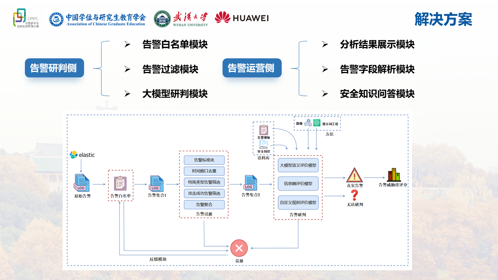

# 告警动态
告警降噪产品：https://www.idss-cn.com/plus/view241230.html
一种基于安全大模型的EDR告警研判机器人：https://xlab.tencent.com/cn/2024/01/26/edr-alert-analysis-robot/
雏鹰云运维平台：https://github.com/yz-intelligence/WeiyingCloud
基于智能合并的告警降噪管理：https://help.aliyun.com/zh/sls/alert-noise-reduction-management-based-on-intelligent-merging
# 告警研判侧

## 告警日志获取

根据业务需求设定时间间隔，定期从Elasticsearch中获取告警日志，告警日志的格式为json。由于一次查询可能获取到大量数据，因此需要对数据进行分批处理。将对应的文件名命名为“告警日志_时间戳”，并存储到本地指定目录，同时传入到kafka消息队列中，使研判过程与日志获取过程解耦和异步进行。

### 输入

- 无直接输入，触发条件为定时任务。

### 处理

1.  连接Elasticsearch。
2.  根据预设查询条件和时间窗口获取告警日志（JSON格式）。
3.  对获取的大量日志进行分批处理。
4.  将每批日志保存为本地文件（命名格式：“告警日志_时间戳.json”）。
5.  将日志文件名或日志内容发送到Kafka指定主题（Topic）。

### 输出

- 本地存储的原始告警日志文件。
- 发送到Kafka的原始告警日志消息。

## 告警白名单模块

### 输入
1.  **告警标准化**: 统一告警日志的格式或关键字段。
    *   *代码实现*: 在 `read_log_file` 读取时完成，将不同来源的日志统一为 `LogEntry` 格式。

- Kafka消息队列中的原始告警日志。
- 告警白名单规则（存储在Redis中）。

*代码实现*: 日志通过 `alert analysis/load_data_new.py` 中的 `read_log_file` 函数读取并解析为 `LogEntry` 对象列表。

### 处理

1.  消费Kafka中的原始告警日志消息。
2.  加载告警白名单规则。
3.  逐条比对告警日志与白名单规则。
4.  过滤掉命中白名单规则的告警。

*代码实现*: 使用 `wlredis.py` 中的 `WhitelistManager` 类和 `filter_by_whitelist` 函数。系统检查每个 `LogEntry` 的六元组信息（日志类型、源/目的IP、源/目的端口、攻击类型）是否存在于 Redis 维护的白名单中。白名单可通过 `api.py` 中的 API 进行管理。

### 输出

- 未命中白名单的告警日志集合（`告警集合1`），传递给告警过滤模块（例如，发送到另一个Kafka主题）。

*数据结构*: `告警集合1` 是经过白名单过滤后的 `LogEntry` 对象列表。在 `alert analysis/process_data.py` 中对应调用 `filter_by_whitelist` 后的 `filter_log_entries` 列表。

## 告警过滤模块

### 输入

- 告警白名单模块输出的告警日志集合（`告警集合1`）。

### 处理


1.  **时间窗口去重**: 在指定时间窗口内，去除重复或高度相似的告警。
    *   *代码实现*: 调用 `alert analysis/filter_by_time.py` 中的 `time_deduplicate` 函数，移除短时间内（如10秒）出现的具有相同关键信息（SIP, DIP, Attack Type, Sport, Dport）的重复告警。
2.  **特殊类型告警筛选**: 根据规则筛选出特定类型的告警（例如，仅保留安全相关告警）。
    *   *代码实现*: 调用 `alert analysis/filter_by_attacktype.py` 中的 `filter_by_attack_type` 函数，根据 `alert analysis/process_data.py` 中定义的 `filters` 规则，过滤掉特定日志类型下的特定攻击类型。
3.  **攻击成功告警筛选**: 根据规则筛选出表示攻击成功的告警。
4.  **告警聚合**: 将关联性强、可归并的告警聚合成一条，减少冗余。
    *   *代码实现*: 调用 `alert analysis/aggregate_alerts.py` 中的 `update_aggregated_alerts` 函数。将经过上述过滤步骤的告警，按照关键信息（sip, dip, log_type, attack_type）进行分组，聚合成 `AggregatedAlert` 对象。每个 `AggregatedAlert` 记录了该组告警的最早/最晚时间、原始告警ID列表 (`ids`) 等信息。

### 输出

- 经过过滤和聚合处理后的告警日志集合（`告警集合2`），传递给大模型研判模块。

*数据结构*: `告警集合2` 是经过过滤和聚合后的告警数据。在 `alert analysis/process_data.py` 中对应 `aggregated_alerts` 字典，其值是 `AggregatedAlert` 对象。后续通常会通过 `AggregatedAlert.to_dict` 方法转换为字典列表用于存储或传输。

## 大模型研判模块

### 输入

- 告警过滤模块输出的告警日志集合（`告警集合2`）。
- 告警模板库。
- 安全知识语料库。
- 预设的自定义规则。
- （可选）用于模型微调和提示工程的方法配置。

*数据流*: `告警集合2` (`aggregated_alerts`) 本身不直接输入大模型。而是，对于集合中的每一个聚合告警项 (`AggregatedAlert`)：
1.  系统根据其 `ids` 列表找到关联的原始告警 (`LogEntry`)。
2.  从原始告警中提取文本字段。
3.  将文本字段构造成 Prompt。
4.  Prompt 发送给大模型进行推理。
5.  将大模型返回的评分写回聚合告警项的 `llm_score` 字段。

### 处理

1.  利用告警模板和安全知识语料库，结合微调和提示词工程方法，准备模型输入。
2.  使用**大模型语义评价模型**对告警进行语义层面的分析和评估。
3.  使用**信息熵评价模型**评估告警信息的不确定性或信息量。
4.  使用**自定义规则评价模型**根据预设规则进行匹配和评估。
5.  综合三个模型的评价结果，对告警进行最终研判。

### 输出

- **研判结果**:
    - `真实告警`：判定为真实有效的告警。
    - `误报`：判定为误报的告警（此结果可用于反馈模块，优化白名单或过滤规则）。
    - `无法研判`：模型无法给出明确判断的告警。
- **告警威胁度评分**: 对判定为`真实告警`的告警进行威胁程度量化评分。

### 大模型语义评价模型详细流程

1.  **接收输入**:
    *   `aggregated_alerts` 字典 (来自 `alert analysis/process_data.py`)，其值为 `AggregatedAlert` 对象列表。
    *   访问原始 `LogEntry` 数据的能力 (通过 Redis 缓存、内存或其他方式，根据 `AggregatedAlert.ids` 查询)。
    *   访问预定义的“告警模板”和“安全知识库”的能力。
    *   **遍历聚合告警**: 迭代 `aggregated_alerts` 字典中的每一个 `AggregatedAlert` 对象。

2.  **准备大模型输入 (Prompt 构建)**:
    *   **获取原始日志**: 对于当前的 `AggregatedAlert`，使用其 `ids` 列表从原始数据源检索对应的 `LogEntry` 对象 (可选择代表性日志)。
    *   **提取关键信息**: 从选定的 `LogEntry` 中提取文本信息，如 `attack_type`, `req_header`, `req_body`, `packet_data` (可能截断), `log_type` 等。
    *   **构建 Prompt**:
        *   **任务描述**: 清晰说明任务 (例如：“评估安全告警风险等级，判断真实攻击可能性，评分0-100”)。
        *   **告警信息**: 格式化提取的关键文本信息。
            ```
            告警类型: [attack_type]
            日志来源: [log_type]
            请求头: [req_header]
            请求体: [req_body]
            原始数据片段: [packet_data snippet]
            ```
        *   **(可选) 补充上下文**: 加入 `attack_type` 的标准描述、模板或相关安全知识。
        *   **输出格式要求**: 明确要求输出格式 (例如：“仅输出评分数字” 或 JSON 格式)。

3.  **调用大模型 API**:
    *   将构建好的 Prompt 发送给大语言模型推理服务 (如通过 HTTP API)。
    *   处理 API 调用错误 (网络、超时、认证等)。

4.  **解析模型输出**:
    *   接收并解析模型响应，提取评分数值。
    *   处理非预期格式或无法评分的情况 (设置默认分或标记)。

5.  **更新分数**:
    *   将解析出的评分更新到当前 `AggregatedAlert` 对象的 `llm_score` 字段。

6.  **循环与输出**:
    *   处理下一个 `AggregatedAlert`，直至全部完成。
    *   输出更新了 `llm_score` 的 `aggregated_alerts`。

7.  **其他考虑**:
    *   **模块化**: 封装 LLM 调用逻辑。
    *   **异步处理**: 使用 `asyncio` 等并发调用 LLM API 以提高效率。
    *   **配置化**: 管理 LLM API 地址、认证、Prompt 模板等配置。
    *   **缓存**: 缓存相同输入的 LLM 评分结果。
    *   **错误处理与重试**: 实现 API 调用重试机制并记录失败。

### 基于 LoRA 微调 Qwen2.5-14B 的参数建议
参考：https://zhuanlan.zhihu.com/p/18758719083
lora原理：https://blog.csdn.net/m0_63171455/article/details/139614304
qwen2.5-32b使用lora微调实例：https://github.com/LFF8888/FF-Studio-Resources


针对使用 13000 条网络安全数据集对 Qwen2.5-14B 模型进行 LoRA 指令微调，以下是一些推荐的起始参数设置。这些值是经验性的，最佳参数需要通过实验获得。

*   **LoRA 参数**:
    *   `r` (Rank): 16 或 32。对于 14B 模型和 3k 数据集，较低的 Rank (如 16) 可能有助于防止过拟合，可以从 16 开始尝试。
    *   `lora_alpha`: 32 (如果 `r=16`) 或 64 (如果 `r=32`)。通常设置为 `r` 或 `2*r`。
    *   `lora_dropout`: 0.05 或 0.1。用于正则化，防止过拟合。
    *   `target_modules`: `['q_proj', 'k_proj', 'v_proj', 'o_proj', 'gate_proj', 'up_proj', 'down_proj']`。需要确认这些是 Qwen2.5-14B 模型的正确模块名称，可能需要查阅模型文档或结构。有时仅微调 `q_proj` 和 `v_proj` 也能获得不错的效果。

*   **训练参数**:
    *   `per_device_train_batch_size`: 尽可能大以适应 GPU 显存，例如 4, 8, 16。配合 `gradient_accumulation_steps` 来达到合适的有效批次大小 (Effective Batch Size)，例如 64 或 128。
    *   `gradient_accumulation_steps`: `Effective Batch Size / (per_device_train_batch_size * num_gpus)`。
    *   `num_train_epochs`: 1 到 3。由于数据集较小，训练可能很快收敛或过拟合，需要密切监控验证集损失。
    *   `learning_rate`: 1e-4 到 3e-4。LoRA 通常使用比全量微调稍高的学习率。
    *   `optimizer`: AdamW (常用 `adamw_torch`)。
    *   `lr_scheduler_type`: `cosine` 或 `linear`，通常带有预热 (warmup)。
    *   `warmup_ratio` 或 `warmup_steps`: 例如 0.03 或 0.1，或者设置固定的 warmup 步数。
    *   `weight_decay`: 0.01 或 0.1。

*   **其他**:
    *   `fp16` 或 `bf16`: True。使用混合精度训练以加速并减少显存占用。`bf16` 通常更稳定，如果硬件支持的话。
    *   `gradient_checkpointing`: True。可以显著减少显存使用，但会增加训练时间。
    *   `logging_steps`: 合理设置以监控训练过程，例如 10 或 50。
    *   `evaluation_strategy`: "steps" 或 "epoch"。配合 `eval_steps` 或在每个 epoch 结束时评估。
    *   `save_strategy`: "steps" 或 "epoch"。配合 `save_steps` 或 `save_total_limit`。

**建议**:
1.  **从小处开始**: 使用较低的 `r` (如 16) 和较小的学习率 (如 1e-4) 开始实验。
2.  **监控验证集**: 密切关注验证集损失 (Validation Loss)，使用早停法 (Early Stopping) 防止过拟合。
3.  **实验调整**: 根据验证集效果调整 `r`, `lora_alpha`, `learning_rate` 等超参数。
4.  **检查目标模块**: 确保 `target_modules` 列表与 Qwen2.5-14B 的实际层名称匹配。
   
## 研判侧评分规则

### 信息熵评分

**目的：** 识别异常或罕见事件。较高的熵通常与异常活动相关，但并非总是恶意。

**输入：** 原始熵值（例如，从数据包头部、载荷特征、通信模式计算得出）。

**评分逻辑：** 你需要在你的环境中建立“正常”熵的基线。当观察到的熵显著偏离此基线或进入已知与某些活动（例如，加密的C2、数据泄露）相关的“高熵”范围时，分数会增加。

**方案1：基于偏差/绝对值的分层评分**

- **0-10 (风险极低)：** 熵在正常基线的1个标准差 (SD) 内，或低于“低”阈值。
- **11-30 (低风险)：** 熵比基线高1-2个标准差，或处于“轻微升高”范围。
- **31-60 (中等风险)：** 熵比基线高2-3个标准差，或处于“中度升高”范围（可能是合法的但异常的流量，如大文件传输，或可疑）。
- **61-80 (高风险)：** 熵比基线高>3个标准差，或处于通常与混淆/加密相关的“显著升高”范围。
- **81-100 (风险极高)：** 熵处于强烈指示恶意技术的范围（例如，DGA、已知具有非常高熵的特定类型的加密C2）。

**方案2：归一化评分** (如果你对异常情况有定义的最小/最大预期熵范围)

`IES = ((当前熵 - 最小异常熵) / (最大异常熵 - 最小异常熵)) * 100`
确保分数限制在0和100之间。这需要更多的前期分析来定义最小异常熵和最大异常熵。

### 自定义规则评分

**目的：** 匹配已知的恶意模式、IOC（Indicators of Compromise）或特定的策略违规。这些通常是高置信度的指标。

**输入：** 规则匹配状态和规则严重性。

**评分逻辑：**

- **0：** 没有自定义规则匹配。
- **20：** 匹配“信息性”严重性规则（例如，策略通知、非关键扫描）。
- **40：** 匹配“低”严重性规则（例如，已知的广告软件、低优先级漏洞利用尝试）。
- **70：** 匹配“中”严重性规则（例如，到已知恶意IP的可疑连接、中等漏洞利用）。
- **90：** 匹配“高”严重性规则（例如，已确认的恶意软件签名、活动的C2通信模式）。
- **100：** 匹配“严重”严重性规则（例如，检测到勒索软件活动、成功的关键漏洞利用）。

如果匹配多个规则，通常取最高严重性规则的分数。

### 大模型语义评分

**目的：** 基于告警的文本描述、相关日志和学习到的模式，理解告警的上下文、意图和潜在的新颖性。

**输入：** LLM对告警的评估（例如，分类如“良性”、“可疑”、“恶意”，以及一个置信度分数）。

**评分逻辑：**

- **0-10：** LLM以高置信度评估为“良性”。（对于非常高的置信度，分数为0；如果置信度较低或存在轻微歧义，则最高为10）。
- **11-30：** LLM评估为“潜在良性”或“信息性”，但存在一些不确定性，或以低置信度评估为“低度可疑”。
- **31-50：** LLM以中等置信度评估为“可疑”，或以低置信度评估为“潜在恶意”。
- **51-75：** LLM以中到高置信度评估为“可能可疑”或“恶意”。
- **76-90：** LLM以高置信度评估为“恶意”。
- **91-100：** LLM以非常高的置信度评估为“严重/高度恶意”，可能识别出新型或复杂的威胁。

这种映射在很大程度上取决于你的LLM的输出格式。如果它给出一个恶意概率（P_malicious，从0到1），你可以简单地计算 `LSS = P_malicious * 100`。

### 权重评分

权重决定了每个模块在最终分数中的相对重要性。这些权重总和应为1（或者如果你喜欢百分比，则为100）。

- **Weight_IES (信息熵)：** 0.20 (20%)
    - **理由：** 对异常检测有用，但高熵并不总是恶意的。它是一个很好的辅助指标。
- **Weight_CRS (自定义规则)：** 0.45 (45%)
    - **理由：** 自定义规则通常基于已知威胁或明确的策略。这里的匹配通常是一个强烈的信号。假设你的规则维护良好且误报率低，则该项权重最高。
- **Weight_LSS (LLM语义)：** 0.35 (35%)
    - **理由：** LLM可以提供细致的理解并检测规则可能遗漏的新型威胁。其权重反映了其潜力，但也承认它可能不如硬编码规则那样具有确定性，尤其是在初期。

### 研判阈值

这些阈值将FAS分类为可操作的严重性级别。

- **FAS <= 30: 低 / 信息性**
    - **措施：** 记录，可能自动关闭，定期审查。除非与其他事件相关联，否则只需最少的即时关注。
- **30 < FAS <= 60: 中 / 可疑**
    - **措施：** 需要一级/二级分析师进行调查。根据资产重要性或其他上下文数据确定优先级。
- **60 < FAS <= 85: 高 / 可能恶意**
    - **措施：** 二级/三级分析师紧急调查。潜在事件。启动遏制/清除计划。
- **FAS > 85: 严重 / 已确认恶意 / 紧急**
    - **措施：** 立即进行事件响应。上报给高级分析师/事件响应团队。可能会触发自动响应措施（如果已配置且可信，例如主机隔离）。

### 改善

1. 使用历史数据和持续的运营反馈来校准。
2. 形成反馈闭环，加入人工审核和反馈机制。
